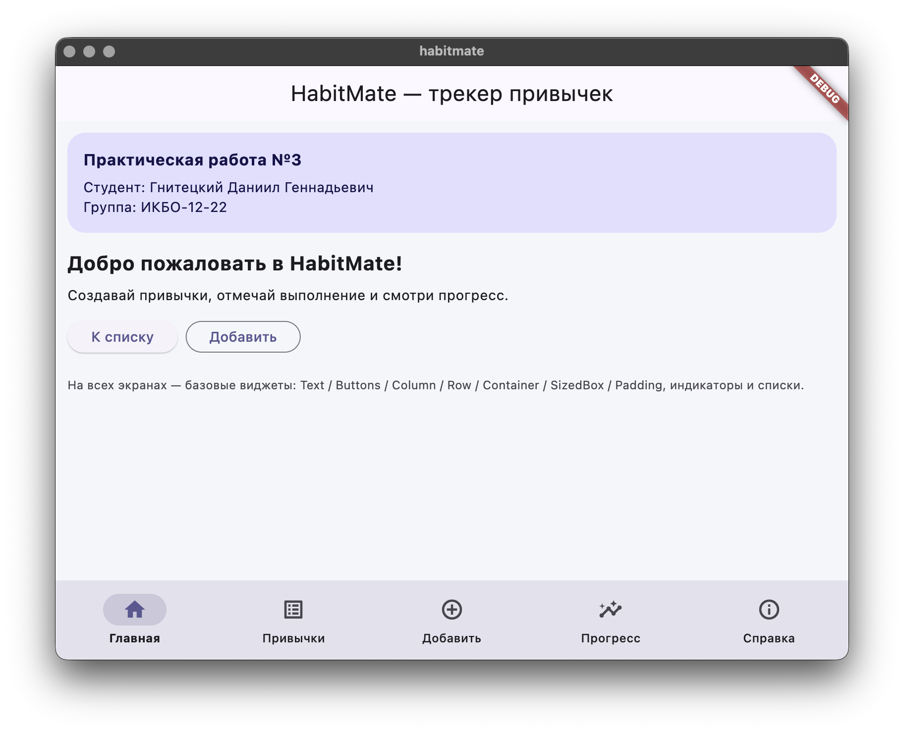

# HabitMate



```
приложение для отслеживания ежедневной рутины, поддерживает добавление новых и отслеживание существующих
```


## Запуск

- Клонируем репозиторий

```bash
git clone https://github.com/FawkesguyD/flutter-practice-3.git
```

- Переходим в рабочую директорию

```bash
cd habitmate
```

- Запускаем приложение, выбираем нужное устройство

```bash
flutter run -d <your_device>
```